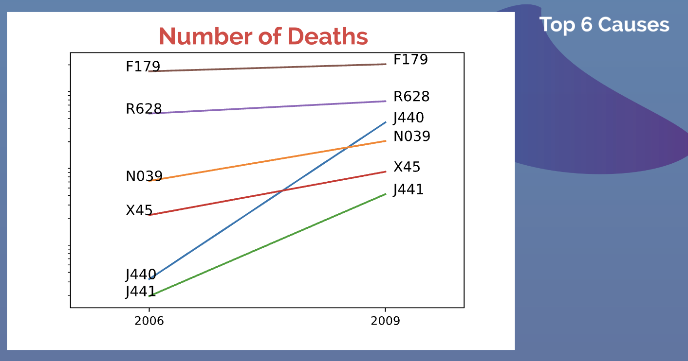
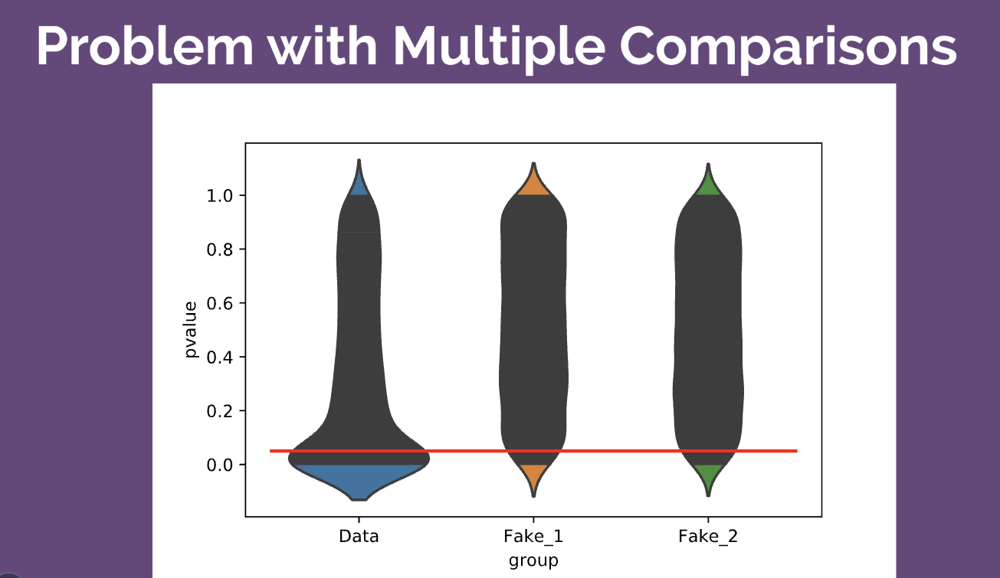

# survival-collaborate
Collaboratative Repo For Analyzing Death and Survival During Great Recession
Collaborators: Moussa Doumbia and Sean Carver

Note: To run the code, you'll need the data, which are too big to place in a GitHub Repo.  
See instructions below.

We obtained data from Kaggle.com.  The data consisted of all death
records (with identifying information redacted) from 2005 to 2015.  We
used the data for 2006 (a boom year) and 2009 (a bust year, during the
Great Recession).  We looked at causes of death.  Many decedents had
several causes assigned to them.  For each cause, we used a binomial
model which assumed that each decedent had the same independent
probability of dying.  We performed inference for this probability,
testing the null hypothesis that the death probabilities were the
same (two-sample z-test for proportions, removing causes for which there were
fewer than 10 decedents, as required by the conditions of this test).
There were over 2,000 comparisons so we used a Bonferroni
correction.  Our sample sizes (equal to the US population in 2006 and
2009) were enormous (appox. 300 M).  Using an alpha of 0.0001 (before
the correction) and a two-sided alternative we found 104 signficant
results where the death proportion was greater in 2009 than 2006.  We
ranked these by Cohen's h (effect size for probabilities) and studied
the top 10, shown here.

The biggest challenge we faced was finding this mapping between codes and
their explanations.  Most sources online had only the first two digits which
gave the category of cause.  The source we found for three digits concerned
diagnostic codes for living people which shared many of the same codes.  We found 
reference for the death codes, but lacked the time to find it in the library.  That
is fodder for future studies.

We plotted a slope graph for the top 6 causes.  See the figure above for the explanations.
Although slope graph is a common plot with many hits on Google, we were not happy with the
software for creating it, although with effort we made due.

Finally, we plotted the p-values as a violin plot.  We had a similar plot in mind, one 
that would have looked like a violin plot but would bin like histogram, but we could 
not find images of such a plot nor software to do it.

We plotted this p-value violins against two from the uniform distribution which we would expect
if all of our null hypotheses were correct.  The image suggests that many of them are not as
revealed by our tests.  The figure also reveals the problem with using alpha=0.05 instead of applying
a Bonferroni correction.  If all of our null hypotheses were correct we would expect that 
about 5% of our p-value would be less than 0.05.  If the number of tests is large, that's a lot 
of significance when there should be none.

Here is a link to the presentation we gave: https://prezi.com/view/fL4qT4fdPz2KdBWE1euK/

Here are the instructions for running the Jupyter notebooks.  They are spread out in many 
files because we needed to close them to clear data before running the next to avoid 
memory issues.

1. Download Death in the United States data from this link: https://www.kaggle.com/cdc/mortality/downloads/mortality.zip/2 
2. If this README.md is in ./ then extract the data into ./data/
3. Switch to ./etl and open and run the jupyter notebook trim2006.ipynb       
4. Close all jupyter notebooks and open and run the jupyter notebook trim2009.ipynb
5. Close all jupyter notebooks and open and run the jupyter notebook etl2006.ipynb
6. Close all jupyter notebooks and open and run the jupyter notebook etl2009.ipynb
7. Takes hours, can skip: Close all jupyter notebooks and open and run the jupyter notebook combine.ipynb
8. combine.ipynb will produce two files k6.savepkl and k9.savepkl.  These are in repository under ./etl
9. Close all jupyter notebooks and Switch to ./analysis and run the jupyter notebook calc_pvalues.ipynb
